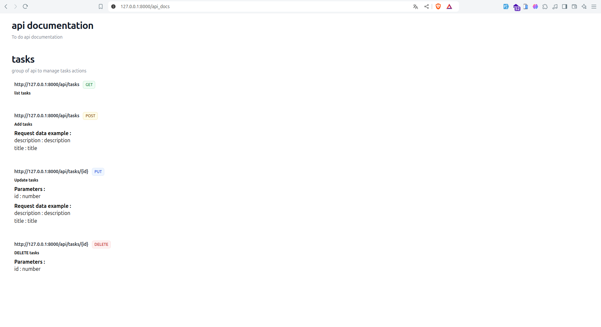

# Proof of concept of the PHP attributes and how can they be used 


### PHP attributes (introduced in PHP 8.0) are a form of metadata that you can add to classes, methods, properties, and functions .
## Use case description
### Let's say you want to list all the routes of your application on a web page. There are different ways to do this, but in this repo, I will show you how to do it using PHP attributes.
## Attributes 
### First let's create the attributes
#### ApiDocumentationRoot Attribute is used to set the title and description of the application and it can be defined only in the controller class
```php
<?php

namespace App\Attributes;

use Attribute;

#[Attribute(Attribute::TARGET_CLASS)]
class ApiDocumentationRoot
{
    public function __construct(
        public string $title,
        public string $description,
    ) {}
}
```
Let's use it in the controller class
```php
<?php

namespace App\Http\Controllers;

use App\Attributes\ApiDocumentationRoot;
use Illuminate\Foundation\Auth\Access\AuthorizesRequests;
use Illuminate\Foundation\Validation\ValidatesRequests;
use Illuminate\Routing\Controller as BaseController;

#[ApiDocumentationRoot("api documentation", "To do api documentation")]
class Controller extends BaseController
{
    use AuthorizesRequests, ValidatesRequests;
}
```
#### The GroupRoute attribute is used in each controller to group its actions together into a groupe, defined by a title and description.
```php
<?php

namespace App\Attributes;

use Attribute;

#[Attribute(Attribute::TARGET_CLASS)]
class GroupRoute
{
    public function __construct(
        public string $groupName,
        public string $description,
    ) {}
}
```
#### The Route attribute is used in each controller method to define the route's structure for that method.
```php
<?php

namespace App\Attributes;

use Attribute;
use Illuminate\Foundation\Http\FormRequest;

#[Attribute(Attribute::TARGET_METHOD)]
class Route
{
    public function __construct(
        private string $method,
        private string $path,
        private ?string $description = null,
        private ?array $parameters = null,
        private ?array $request = null
    ) {}


    /**
     * Get the value of method
     */
    public function getMethod()
    {
        return $this->method;
    }

    /**
     * Set the value of method
     *
     * @return  self
     */
    public function setMethod($method)
    {
        $this->method = $method;

        return $this;
    }

    /**
     * Get the value of path
     */
    public function getPath()
    {
        return $this->path;
    }

    /**
     * Set the value of path
     *
     * @return  self
     */
    public function setPath($path)
    {
        $this->path = $path;

        return $this;
    }

    /**
     * Get the value of description
     */
    public function getDescription()
    {
        return $this->description;
    }

    /**
     * Set the value of description
     *
     * @return  self
     */
    public function setDescription($description)
    {
        $this->description = $description;

        return $this;
    }

    /**
     * Get the value of parameters
     */
    public function getParameters()
    {
        return $this->parameters;
    }

    /**
     * Set the value of parameters
     *
     * @return  self
     */
    public function setParameters($parameters)
    {
        $this->parameters = $parameters;

        return $this;
    }

    /**
     * Get the value of request
     */
    public function getRequest()
    {
        return $this->request;
    }

    /**
     * Set the value of request
     *
     * @return  self
     */
    public function setRequest($request)
    {
        $this->request = $request;

        return $this;
    }
}

```
How to use these attributes in a controller
```php
<?php

namespace App\Http\Controllers\Api;

use App\Attributes\GroupRoute;
use App\Attributes\Route;
use App\Http\Controllers\Controller;
use App\Http\Requests\CreateTaskRequest;
use App\Http\Requests\EditTaskRequest;
use App\Models\Task;
use Illuminate\Http\Request;


#[GroupRoute("tasks", "group of api to manage tasks actions")]
class TaskController extends Controller
{
    #[Route(description: "list tasks", method: "GET", path: "/tasks")]
    public function index()
    {
        return response()->json(["data" => Task::all()]);
    }
    #[Route(description: "Add tasks", method: "POST", path: "/tasks", request: ["description" => "description", "title" => "title"])]
    public function store(CreateTaskRequest $request)
    {

        $validatedData = $request->only(["description", "title"]);
        $task = Task::create($validatedData);

        return response()->json($task, 201);
    }

    #[Route(description: "Update tasks", method: "PUT", path: "/tasks/{id}", parameters: ["id" => "number"], request: ["description" => "description", "title" => "title"])]
    public function update(EditTaskRequest $request, string $id)
    {
        //
        $validatedData = $request->only(["description", "title"]);


        $task = Task::findOrFail($id);
        $task->update($validatedData);

        return response()->json($task);
    }

    #[Route(description: "DELETE tasks", method: "DELETE", path: "/tasks/{id}", parameters: ["id" => "number"])]
    public function destroy(string $id)
    {
        //
        $task = Task::findOrFail($id);
        $task->delete();

        return response()->json(null, 204);
    }
}
```
### Now that we've added the necessary metadata for listing the routes, how can we actually display get this metadata and display it?
#### Let's define a class service to scan the project for this metadata 
```php
<?php

namespace App\Services;

use App\Attributes\ApiDocumentationRoot;
use App\Attributes\GroupRoute;
use App\Attributes\Route;
use App\Helpers\PathHelper;
use App\Http\Controllers\Controller;
use Illuminate\Support\Facades\File;
use ReflectionClass;
use ReflectionMethod;

class AttributesService
{
    public static function getApiDocumentationAttributes(): array
    {
        // Create a reflection class for the parent Controller class
        $reflection = new ReflectionClass(Controller::Class);
        // Get the attributes of the class
        $attributes = $reflection->getAttributes(ApiDocumentationRoot::class);
        // Check if the attribute exists
        if (!empty($attributes)) {
            // Get the instance of the attribute
            $apiDocumentationRootInstance = $attributes[0]->newInstance();

            // Access the properties of the attribute
            $title = $apiDocumentationRootInstance->title;
            $description = $apiDocumentationRootInstance->description;

            return [
                'title' => $title,
                'description' => $description,
            ];
        }

        return [
            'error' => 'No ApiDocumentationRoot attribute found.'
        ];
    }
    public static function getDocumentGroupData(): array
    {
        $directory = app_path('Http/Controllers');
        $namespace = 'App\\Http\\Controllers\\';
        $results = [];

        // Get all PHP files in the specified directory recursively
        $files = File::allFiles($directory);

        foreach ($files as $file) {
            // Convert file path to class name
            $class = AttributesService::getClassFromFile($file, $namespace);

            if (class_exists($class)) {
                $reflectionClass = new ReflectionClass($class);

                // Check for GroupRoute attribute
                $attributes = $reflectionClass->getAttributes(GroupRoute::class);

                $routes = [];
                foreach ($reflectionClass->getMethods(ReflectionMethod::IS_PUBLIC) as $method) {
                    $methodAttributes = $method->getAttributes(Route::class);
                    foreach ($methodAttributes as $attribute) {
                        $new_routes = $attribute->newInstance();
                        $routes[] = [
                            "path" =>  env("APP_URL") . "/api" . $new_routes->getPath(),
                            "method" => $new_routes->getMethod(),
                            "description" => $new_routes->getDescription(),
                            "parameters" => $new_routes->getParameters(),
                            "request" => $new_routes->getRequest(),
                        ];
                    }
                }

                if (!empty($attributes)) {
                    // Instantiate the attribute and retrieve its properties
                    $groupRouteInstance = $attributes[0]->newInstance();
                    $results[] = [
                        'groupName' => $groupRouteInstance->groupName,
                        'description' => $groupRouteInstance->description,
                        'routes' => $routes,
                    ];
                }
            }
        }

        return $results;
    }

    public static  function getClassFromFile($file, $namespace): string
    {
        // Remove base directory and ".php" from file path
        $relativePath = str_replace([base_path('app/Http/Controllers/'), '/', '.php'], ['', '\\', ''], $file->getRealPath());

        // Combine the namespace with the relative path
        return $namespace . $relativePath;
    }
}
```
#### This class scan the controller and the controllers of the project to get this metadata , so let's use it inside our controller
```php
<?php

namespace App\Http\Controllers;

use App\Services\AttributesService;
use Illuminate\Http\Request;

class ApiDocumentationController extends Controller
{
    //
    public function index()
    {
        $data = AttributesService::getApiDocumentationAttributes();
        $groups = AttributesService::getDocumentGroupData();
        /* return response()->json([
            "data" => $data,
            "groups" => $groups,
        ]); */
        return view("apiDocs.index")->with("groups", $groups)->with("data", $data);
    }
    public function indexJson()
    {
        $data = AttributesService::getApiDocumentationAttributes();
        $groups = AttributesService::getDocumentGroupData();
        return response()->json([
            "data" => $data,
            "groups" => $groups,
        ]);
    }
}

```
#### In this controller we have the JSON version of the metadata and ui version .
#### JSON version : 
```json
{
   "data":{
      "title":"api documentation",
      "description":"To do api documentation"
   },
   "groups":[
      {
         "groupName":"tasks",
         "description":"group of api to manage tasks actions",
         "routes":[
            {
               "path":"http://127.0.0.1:8000/api/tasks",
               "method":"GET",
               "description":"list tasks",
               "parameters":null,
               "request":null
            },
            {
               "path":"http://127.0.0.1:8000/api/tasks",
               "method":"POST",
               "description":"Add tasks",
               "parameters":null,
               "request":{
                  "description":"description",
                  "title":"title"
               }
            },
            {
               "path":"http://127.0.0.1:8000/api/tasks/{id}",
               "method":"PUT",
               "description":"Update tasks",
               "parameters":{
                  "id":"number"
               },
               "request":{
                  "description":"description",
                  "title":"title"
               }
            },
            {
               "path":"http://127.0.0.1:8000/api/tasks/{id}",
               "method":"DELETE",
               "description":"DELETE tasks",
               "parameters":{
                  "id":"number"
               },
               "request":null
            }
         ]
      }
   ]
}
```
#### UI version : 


